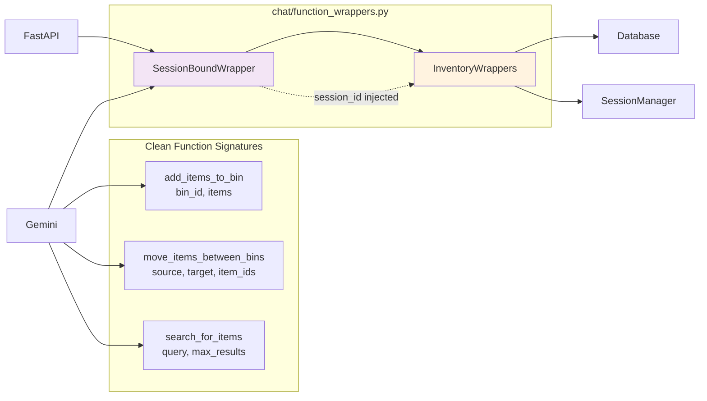
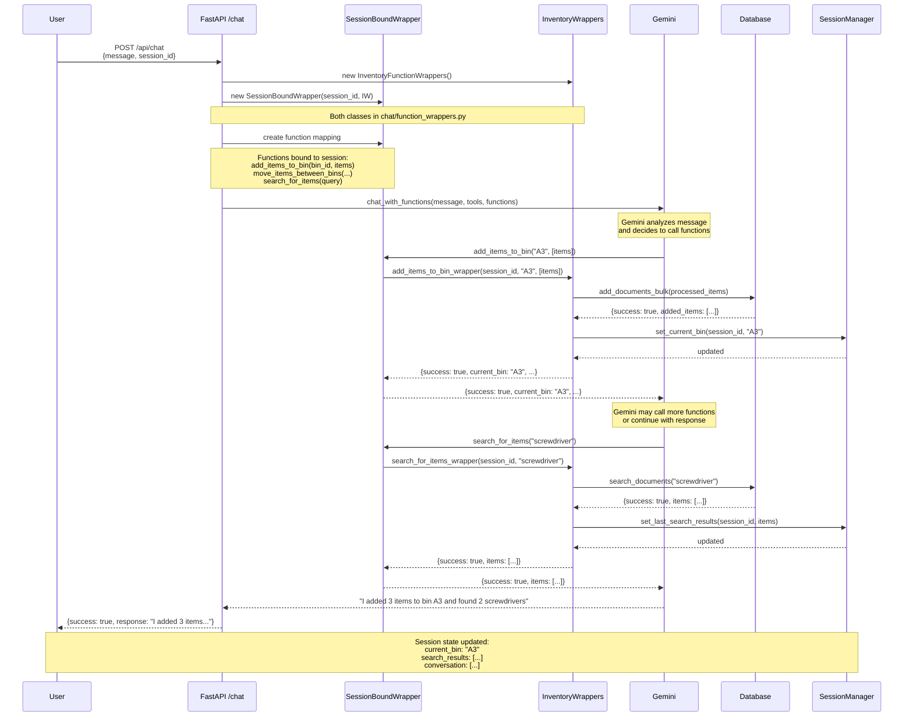

# BinBot — Technical Specification

## Overview
BinBot is an AI-assisted inventory system that lets users manage storage bins via natural language and images. It integrates:

- FastAPI backend API
- Chat/LLM orchestration for function calling
- Vision/image analysis and storage
- Vector search via ChromaDB
- A simple single-page HTML UI
- Docker-based development and deployment

Key behaviors:

- Efficient, targeted API endpoints (no over-fetching)
- UI shows the contents of the last bin worked on
- Items added from images maintain association to the source image

---

## Architecture

- **Frontend**: Static HTML page with a simple split layout: left chat (with camera button) and right bin contents.
- **Backend API**: FastAPI app exposing REST endpoints for inventory operations, images, and chat.
- **Chat Layer**: Command parsing, function selection and dispatching (Gemini tool/function calling).
- **LLM Layer**: Text LLM client, embeddings service, and vision utilities.
- **Database**: ChromaDB for vectorized item metadata (name, description, bin_id, embeddings) and audit logs.
- **Storage**: Local image store with metadata updates and ID-based lookup.
- **Session/Conversation**: Track session state, conversation history, and current bin context.
- **Config**: Centralized settings and embeddings configuration.

---

## Key Files, Responsibilities, and Proposed Main Functions

### Application Entry
- **app.py**
  - `create_app()`: Build and configure the FastAPI app (mount routers, CORS, static).
  - `run()`: Start the app with Uvicorn (or executed via Docker/start.sh).

- **start.sh**
  - `main()`: Shell entrypoint to launch the API server in Docker/local.

- **docker-compose.yml / docker-compose.yaml**
  - Services definition (API, optional vector DB backing, volumes, networks).

- **Dockerfile**
  - Defines runtime environment for API and dependencies.

### API Layer (FastAPI Implementation)

#### Inventory Operations
- **api/inventory.py**
  - `add_items()`: **POST /api/items/add**
    - **Purpose**: Add items with embeddings to a bin; optionally link image_id
    - **Request**: `{ bin_id: string, items: [{name: string, description?: string, image_id?: string}] }`
    - **Response**: `{ success: boolean, added_items: array, failed_items: array, current_bin: string }`

  - `remove_items()`: **POST /api/items/remove**
    - **Purpose**: Remove items from a bin using item IDs
    - **Request**: `{ bin_id: string, item_ids: [string] }`
    - **Response**: `{ success: boolean, removed_items: array, not_found_items: array, current_bin: string }`

  - `move_items()`: **POST /api/items/move**
    - **Purpose**: Move items between bins using item IDs
    - **Request**: `{ source_bin_id: string, target_bin_id: string, item_ids: [string] }`
    - **Response**: `{ success: boolean, moved_items: array, not_found_items: array, current_bin: string }`

  - `search_items()`: **POST /api/items/search**
    - **Purpose**: Semantic search over inventory
    - **Request**: `{ query: string, limit?: number }`
    - **Response**: `{ success: boolean, items: array }`

#### Image Operations

- **api/images.py** - `upload_image()`: **POST /api/images**
  - **Purpose**: Upload image, auto-analyze, return structured items
  - **Request**: Form: multipart file
  - **Response**: `{ success: boolean, image_id: string, analyzed_items: [{name: string, description: string}] }`

- **api/images.py** - `analyze_image()`: **POST /api/images/{image_id}/analyze**
  - **Purpose**: Re-analyze image with optional context
  - **Request**: `{ context?: string }`
  - **Response**: `{ success: boolean, items: [{name: string, description: string}] }`

- **api/images.py** - `get_image()`: **GET /images/{image_id}**
  - **Purpose**: Serve stored image asset
  - **Response**: Image file (JPEG/PNG)

#### Session Operations


- **api/session.py** - `start_session()`: **POST /api/session**
  - **Purpose**: Create session with UUID, set secure cookie, initialize state
  - **Response**: `{ success: boolean, session_id: string }`
  - **Cookie**: Sets `session_id` cookie (httponly, secure, 30min TTL)

- **api/session.py** - `get_session()`: **GET /api/session/{id}**
  - **Purpose**: Retrieve session state (current bin, conversation length, etc.)
  - **Response**: `{ success: boolean, session: { session_id: string, created_at: string, last_accessed: string, current_bin: string, conversation: [{ role: string, content: string }] } }`

- **api/session.py** - `end_session()`: **DELETE /api/session/{id}**
  - **Purpose**: End session, clear from memory, delete cookie
  - **Response**: `{ success: boolean }`
  - **Cookie**: Deletes `session_id` cookie

- **api/voice.py** - `transcribe()`: **POST /api/voice/transcribe**
  - **Purpose**: Speech-to-text ingestion (if used)
  - **Request**: Form: multipart audio file
  - **Response**: `{ success: boolean, text: string }`

#### Chat operations

- **api/chat.py** - `chat()`: **POST /api/chat/command**
  - **Purpose**: Create session-bound functions, send to Gemini with automatic execution
  - **Request**: `{ message: string, session_id: string }`
  - **Response**: `{ success: boolean, response: string }`
  - **Process**: Creates `SessionBoundFunctionWrapper` → Maps to Gemini functions → Auto-execution.

- **api/chat.py** - `chat_image()`: **POST /api/chat/image**
  - **Purpose**: Upload image, analyze contents, and add to session context
  - **Request**: Form: multipart file + `{ session_id: string, context?: string }`
  - **Response**: `{ success: boolean, image_id: string, analyzed_items: [{name: string, description: string}] }`
  - **Process**: Uploads image → Vision analysis → Stores in session context for LLM
  
#### System Operations

- **api/health.py** - `health_check()`: **GET /health**
  - **Purpose**: Liveness/readiness probe
  - **Response**: `{ status: "ok" }`

#### Data Models

- **api_schemas.py**
  - Pydantic models for request/response DTOs (e.g., ItemAddRequest, SearchRequest, ChatRequest)

#### Session Architecture

**In-Memory Session Store with TTL Management:**

```python
# Session structure
{
  "session_id": "f47ac10b-58cc-4372-a567-0e02b2c3d479",
  "created_at": datetime,
  "last_accessed": datetime,
  "current_bin": "A3",
  "conversation": [
    {"role": "user", "content": "Add screwdriver to bin A3"},
    {"role": "assistant", "content": "Added Phillips screwdriver to bin A3"}
  ],
}
```

**Key Features:**
- **UUID Session IDs**: Cryptographically secure using `uuid.uuid4()`
- **HTTP-Only Cookies**: Secure session ID storage, prevents XSS
- **30-minute TTL**: Automatic expiration with lazy cleanup
- **In-Memory Storage**: Fast access, no external dependencies
- **Background Cleanup**: Periodic removal of expired sessions

### Chat Orchestration

- **chat/function_wrappers.py**
  - `InventoryFunctionWrappers`: Main class containing business logic for all inventory operations.
  - `SessionBoundFunctionWrapper`: Binds inventory functions to a specific session.
  - Individual wrapper methods with side effects (current_bin updates, logging, image associations).
  - Session-bound methods match Gemini function signatures exactly (no session_id parameter).
  - Handles embeddings, database operations, and error handling.

- **chat/function_definitions.py**
  - `get_all_function_names()`: Return supported function names for the LLM's tool schema.
  - `get_gemini_inventory_functions()`: Complete Gemini function schemas.
  - `get_function_by_name(function_name)`: Get specific function schema by name.

- **chat/conversation_manager.py**
  - `get_conversation(session_id)`: Retrieve conversation history and system messages.
  - `append_message(session_id, role, content)`: Add to conversation context.
  - `set_current_bin(session_id, bin_id)`: Maintain current/last bin context.

### LLM & Vision
- **llm/client.py**
  - `chat_completion(messages, tools)`: Call Gemini LLM with automatic function execution enabled.
  - `GeminiProvider`: Gemini-specific implementation with AUTO mode function calling.
  - `tool_config`: Configured for `FunctionCallingConfig.Mode.AUTO` - functions execute automatically.

- **llm/embeddings.py**
  - `generate_embedding(text)`: Create vector embedding used across inventory operations.
  - `batch_generate_embedding(texts)`: Efficient batched embeddings.

- **llm/vision.py**
  - `analyze_image_for_items(image_path, context)`: Gemini Vision API to identify items and return structured JSON.
  - `describe_for_accessibility(image_path)`: Produce accessible descriptions (if needed).

### Database / Vector Store
- **database/chromadb_client.py**
  - `add_documents_bulk(items)`: Insert multiple items (name, description, bin_id, embedding, timestamps).
  - `search_documents(query, limit, min_relevance, embedding_service)`: Vector search.
  - `remove_document(id)`: Delete item by UUID identifier.
  - `update_item_bin(item_id, new_bin_id)`: Update item's bin location by UUID.
  - `add_image_to_item(item_id, image_id, set_as_primary)`: Link image to item metadata.
  - `add_audit_log_entry(entry)`: Append structured audit events.
  - `inventory_collection`: Property exposing underlying ChromaDB collection for updates.

### Image Storage
- **storage/image_storage.py**
  - `save_image(file)`: Persist uploaded image and return image_id.
  - `update_image_metadata(image_id, metadata)`: Maintain associations (item_id, bin_id).
  - `get_image_path(image_id, size)`: Resolve path by ID and variant (full/thumbnail).

### Session Management
- **session/session_manager.py**
  - `SessionManager`: In-memory session store with TTL and cleanup
  - `new_session()`: Generate UUID session ID, create initial session state
  - `get_conversation(session_id)`: Retrieve conversation history from session
  - `set_current_bin(session_id, bin_id)`: Track the last/active bin for UI context
  - `cleanup_expired_sessions()`: Remove sessions past TTL (30 minutes default)
  - `end_session(session_id)`: Explicit cleanup and finalize
  - `_is_expired(session)`: Check if session has exceeded TTL

### Config
- **config/settings.py**
  - `load_settings()`: Aggregate runtime configuration (env, YAML).
  - `get_config()`: Singleton accessor for settings.

- **config/embeddings.py**
  - `get_embedding_model()`: Choose and configure embedding backend.

- **config.yaml**
  - Static configuration values (e.g., model names, thresholds, storage paths).

### Frontend
- **frontend/index.html**
  - Single-page app shell: left chat + camera button; right panel for current bin contents.

- **frontend/main.html**
  - Alternative or legacy static page for local/demo usage.

### Utilities
- **utils/image_optimizer.py**
  - `optimize_image(path)`: Resize/compress images per target constraints.
  - `ensure_max_dimensions(path, w, h)`: Limit size for bandwidth/perf.

### Data
- **data/images**
  - Stored images managed by ImageStorage.

- **data/chromadb**
  - Vector DB files for ChromaDB.

### Tests (selected)
- **test/test_ui_workflow_scenario.py**: UI workflow happy path
- **test/test_chat_simple.py**: Chat basic commands
- **test/test_image_context.py**: Image associations and context
- **test/test_image_upload.py**: Upload flow
- **test/test_complete_flow.py**: End-to-end integration
- Additional tests cover performance, optimization, and LLM/vision behavior.


## LLM Function Schemas

The system uses Gemini's automatic function calling (AUTO mode) to enable seamless execution of inventory operations. Gemini automatically decides when to call functions and can chain multiple function calls without manual intervention. Image analysis is handled automatically on upload, not as LLM functions. These schemas are defined in `chat/function_definitions.py` and passed to the LLM during chat completion.

### LLM Inventory Functions

The LLM has access to these 5 core inventory management functions:

#### add_items_to_bin
```python
genai.protos.FunctionDeclaration(
    name="add_items_to_bin",
    description="Add one or more items to a specific bin in the inventory system",
    parameters=genai.protos.Schema(
        type=genai.protos.Type.OBJECT,
        properties={
            "items": genai.protos.Schema(
                type=genai.protos.Type.ARRAY,
                items=genai.protos.Schema(
                    type=genai.protos.Type.OBJECT,
                    properties={
                        "name": genai.protos.Schema(
                            type=genai.protos.Type.STRING,
                            description="The name of the item"
                        ),
                        "description": genai.protos.Schema(
                            type=genai.protos.Type.STRING,
                            description="Optional detailed description of the item"
                        ),
                        "image_id": genai.protos.Schema(
                            type=genai.protos.Type.STRING,
                            description="Optional image ID to associate with this specific item"
                        )
                    },
                    required=["name"]
                ),
                description="List of items to add to the bin. Each item can have a name, optional description, and optional image_id"
            ),
            "bin_id": genai.protos.Schema(
                type=genai.protos.Type.STRING,
                description="The ID/number of the bin to add items to (e.g., 'A3', 'B5', 'TOOLS12')"
            )
        },
        required=["items", "bin_id"]
    )
)
```

#### remove_items_from_bin
```python
genai.protos.FunctionDeclaration(
    name="remove_items_from_bin",
    description="Remove one or more items from a specific bin in the inventory system using item IDs",
    parameters=genai.protos.Schema(
        type=genai.protos.Type.OBJECT,
        properties={
            "item_ids": genai.protos.Schema(
                type=genai.protos.Type.ARRAY,
                items=genai.protos.Schema(type=genai.protos.Type.STRING),
                description="List of item IDs (UUIDs) to remove from the bin"
            ),
            "bin_id": genai.protos.Schema(
                type=genai.protos.Type.STRING,
                description="The ID/number of the bin to remove items from (e.g., 'A3', 'B5', 'TOOLS12')"
            )
        },
        required=["item_ids", "bin_id"]
    )
)
```

#### move_items_between_bins
```python
genai.protos.FunctionDeclaration(
    name="move_items_between_bins",
    description="Move one or more items from one bin to another bin using item IDs",
    parameters=genai.protos.Schema(
        type=genai.protos.Type.OBJECT,
        properties={
            "item_ids": genai.protos.Schema(
                type=genai.protos.Type.ARRAY,
                items=genai.protos.Schema(type=genai.protos.Type.STRING),
                description="List of item IDs (UUIDs) to move between bins"
            ),
            "source_bin_id": genai.protos.Schema(
                type=genai.protos.Type.STRING,
                description="The ID/number of the bin to move items from (e.g., 'A3', 'B5', 'TOOLS12')"
            ),
            "target_bin_id": genai.protos.Schema(
                type=genai.protos.Type.STRING,
                description="The ID/number of the bin to move items to (e.g., 'A3', 'B5', 'TOOLS12')"
            )
        },
        required=["item_ids", "source_bin_id", "target_bin_id"]
    )
)
```

#### search_for_items
```python
genai.protos.FunctionDeclaration(
    name="search_for_items",
    description="Search for items in the inventory system using semantic search. Returns items with their names, descriptions, bin locations, and associated images.",
    parameters=genai.protos.Schema(
        type=genai.protos.Type.OBJECT,
        properties={
            "query": genai.protos.Schema(
                type=genai.protos.Type.STRING,
                description="Search query to find items (e.g., 'electronics', 'screws', 'tools')"
            ),
            "max_results": genai.protos.Schema(
                type=genai.protos.Type.INTEGER,
                description="Maximum number of results to return (default: 10)"
            )
        },
        required=["query"]
    )
)
```

#### list_bin_contents
```python
genai.protos.FunctionDeclaration(
    name="list_bin_contents",
    description="List all items in a specific bin. Returns items with their names, descriptions, and associated images.",
    parameters=genai.protos.Schema(
        type=genai.protos.Type.OBJECT,
        properties={
            "bin_id": genai.protos.Schema(
                type=genai.protos.Type.STRING,
                description="The ID/number of the bin to list contents for (e.g., 'A3', 'B5', 'TOOLS12')"
            )
        },
        required=["bin_id"]
    )
)
```


### Function Schema Access
- **`get_gemini_inventory_functions()`**: Returns all function schemas in Gemini format
- **`get_function_by_name(function_name)`**: Get specific function schema by name
- **`get_all_function_names()`**: Get list of all available function names

### Automatic Function Execution Architecture

**Gemini AUTO Mode Configuration:**
```python
tool_config = genai.protos.ToolConfig(
    function_calling_config=genai.protos.FunctionCallingConfig(
        mode=genai.protos.FunctionCallingConfig.Mode.AUTO
    )
)
```

**Execution Flow:**
1. **User Message** → Sent to Gemini with function schemas and AUTO mode
2. **Gemini Analysis** → Automatically decides which functions to call (if any)
3. **Function Execution** → Gemini calls functions directly, receives results
4. **Multi-Step Operations** → Gemini can chain multiple function calls automatically
5. **Final Response** → User receives complete answer with all operations completed

**Example Multi-Step Operation:**
- **User**: "Move all electronics from bin A3 to bin B5"
- **Gemini automatically**:
  1. Calls `list_bin_contents(bin_id="A3")`
  2. Analyzes results to identify electronics
  3. Calls `move_items_between_bins(item_ids=[...], source_bin_id="A3", target_bin_id="B5")`
  4. Returns final success message to user

**Benefits:**
- **Seamless UX**: No manual function approval needed
- **Complex Workflows**: Multi-step operations handled automatically
- **Intelligent Decisions**: Gemini determines optimal function sequence
- **Error Recovery**: Can retry or adjust approach if functions fail

### Session-Bound Function Architecture

**Problem**: Gemini function schemas cannot include `session_id`, but our functions need session context.

**Solution**: Session-bound wrapper that injects session_id automatically.

#### Component Architecture


#### Execution Flow


**Function Side Effects:**
- **Add/Remove/List**: Updates current_bin, **Move**: Updates to target_bin, **Search**: No current_bin change

### Key Schema Features
- **Rich Item Structure**: Items support both names and optional descriptions
- **Individual Image Associations**: Each item can have its own image_id when adding
- **Flexible Bin IDs**: Support alphanumeric bin identifiers (e.g., 'A3', 'TOOLS12')
- **Unambiguous Operations**: Move and remove operations use item UUIDs to eliminate ambiguity
- **Automatic Image Analysis**: Images are analyzed on upload, returning structured item data for LLM context
- **Automatic Function Execution**: Gemini executes functions automatically in AUTO mode, enabling seamless multi-step operations
- **Session-Bound Functions**: Functions automatically include session context without exposing session_id to Gemini
- **Smart Side Effects**: Each function type has tailored side effects (current_bin updates, logging, etc.)
- **Comprehensive Retrieval**: Search and list functions return full item details including descriptions and images

---

## Item Schema

### Base Item Structure

The core item entity used throughout the system:

```json
{
  "id": "string (UUID)",
  "name": "string (required)",
  "description": "string (optional)",
  "bin_id": "string (required, alphanumeric)",
  "embedding": "vector (generated from name + description)",
  "created_at": "string (ISO datetime)",
  "updated_at": "string (ISO datetime)",
  "embedding_model": "string (e.g., 'openai')",
  "images": [
    {
      "image_id": "string",
      "is_primary": "boolean",
      "created_at": "string (ISO datetime)"
    }
  ]
}
```

### Item Input Schema (for adding items)

When adding items via function calls or API:

```json
{
  "name": "string (required, min length 1)",
  "description": "string (optional)",
  "image_id": "string (optional)"
}
```

### Item Response Schema (from search/list operations)

When retrieving items from search or list operations:

```json
{
  "id": "string (UUID)",
  "name": "string",
  "description": "string (may be empty)",
  "bin_id": "string",
  "created_at": "string (ISO datetime)",
  "updated_at": "string (ISO datetime)",
  "images": ["string (image_id)"],
  "primary_image": "string (image_id, optional)",
  "confidence_score": "number (for search results, 0.0-1.0)"
}
```

### Field Descriptions

- **id**: Unique identifier (UUID) generated by the system
- **name**: Human-readable item name (required, used for search and display)
- **description**: Optional detailed description (enhances search accuracy via embeddings)
- **bin_id**: Alphanumeric identifier for the storage bin (e.g., 'A3', 'TOOLS12', 'BIN-ELECTRONICS')
- **embedding**: Vector representation generated from name + description for semantic search
- **images**: Array of associated image IDs, supporting multiple images per item
- **primary_image**: The main/featured image for the item (optional)
- **confidence_score**: Relevance score for search results (0.0 = no match, 1.0 = perfect match)

---

## Data Model (Conceptual)

- **Item**
  - id (UUID), name, description (optional), bin_id, embedding (vector), created_at, embedding_model
  - images: [image_id] (multiple images supported, each item can have individual image associations)

- **Image**
  - image_id, path, metadata { item_id?, bin_id? }, created_at

- **Audit Log**
  - operation_id, type (add|remove|move), item_ids (array), bin_id(s), description, timestamp, metadata

---

## Non-Functional Requirements

- **Performance**: Use bulk adds and batched embeddings; avoid fetching all items where not needed.
- **Reliability**: Audit logged mutations; clear error messaging in NLP formatting for the UI.
- **UX**: Single-page UI; always show last active/current bin; simple chat + camera button.
- **Deployability**: Dockerized; compose file for local dev; environment-based config. 

---

## Open Proposals / Enhancements

- Enhanced Gemini function validation: Leverage Gemini's native schema validation for stricter parameter checking.
- `api/session`: Consider endpoint to set/get current_bin directly for UI affordance.
- Pagination/limits: Apply to search and list_bin for large inventories.
- Gemini multimodal: Current architecture uses Gemini Vision for automatic image analysis on upload.
- Context-aware analysis: Enhance image analysis with bin location context for better item identification.
- Image cleanup: Consider automatic cleanup of unused images (images not associated with any items).
- Session persistence: Consider Redis backend for session store if horizontal scaling needed.
- Session security: Implement session rotation for sensitive operations.
- Memory management: Add LRU eviction if session memory usage becomes an issue.

If you'd like, I can extend this spec with exact endpoint signatures (Pydantic models) from api_schemas.py and verify real function names in each api/*.py module.
